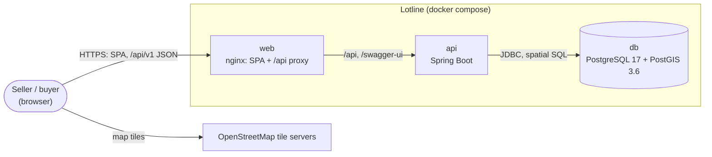
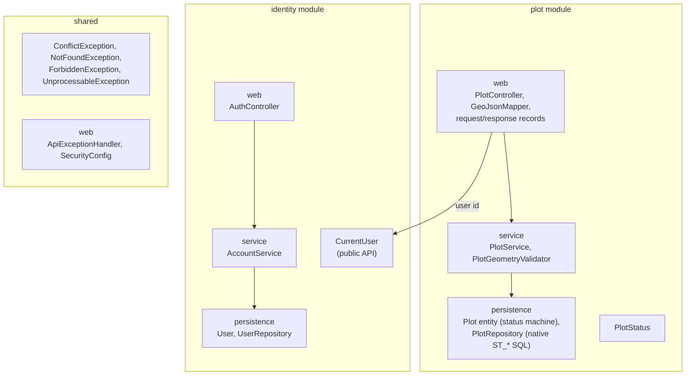
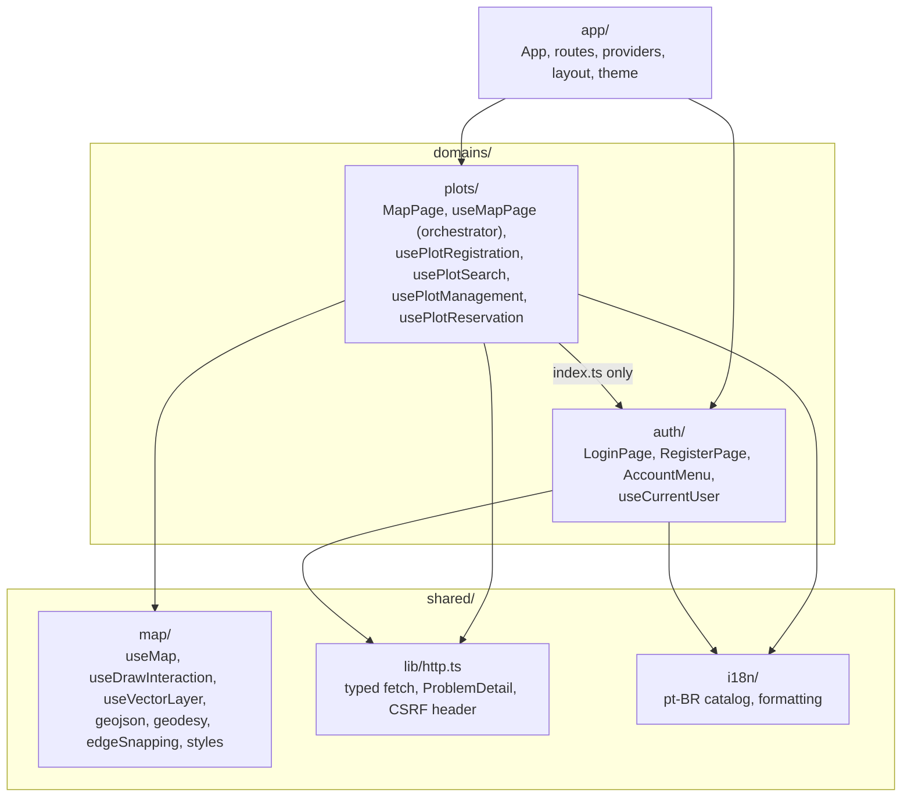
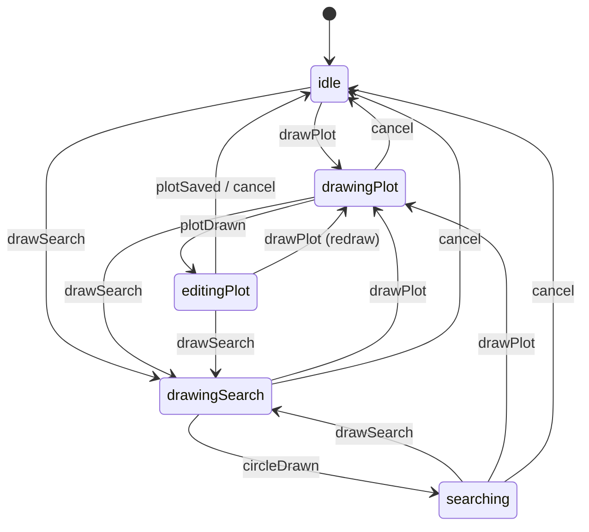
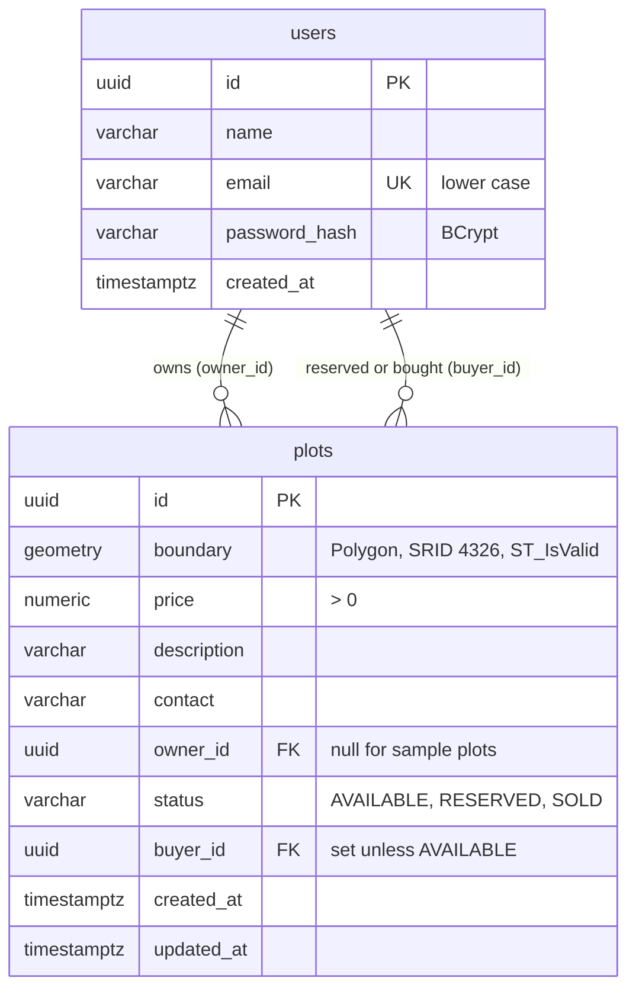
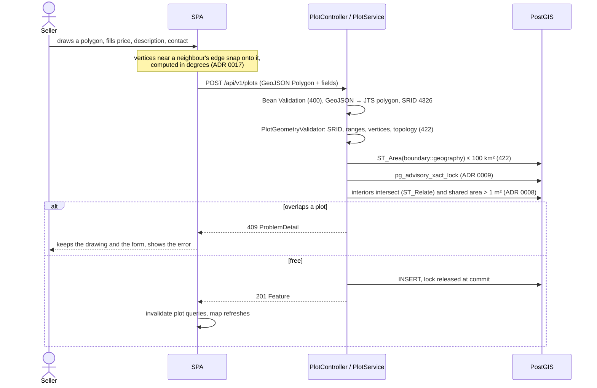
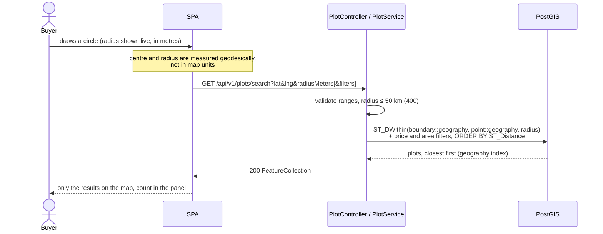
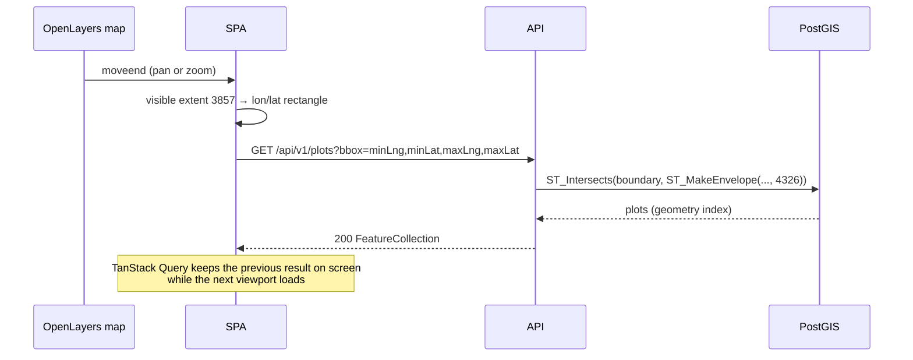
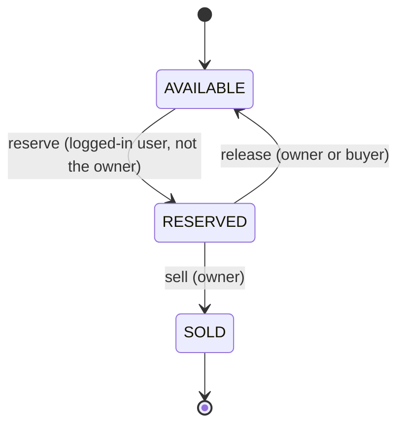
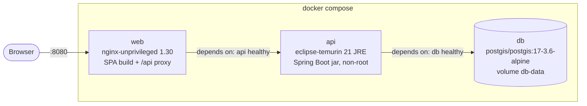

# Lotline architecture

A map-based marketplace for land plots. Sellers draw a plot's exact boundary on a map and list it; buyers draw a circle to find plots that reach into it, open a plot to see its details, and reserve it. This document is the overview; each non-obvious choice has its own decision record, indexed in [section 9](#9-architecture-decisions).

Contents:

1. [Requirements and quality goals](#1-requirements-and-quality-goals)
2. [Context](#2-context)
3. [Solution strategy](#3-solution-strategy)
4. [Building blocks](#4-building-blocks)
5. [Data](#5-data)
6. [Runtime flows](#6-runtime-flows)
7. [Deployment](#7-deployment)
8. [Cross-cutting concerns](#8-cross-cutting-concerns)
9. [Architecture decisions](#9-architecture-decisions)
10. [Risks and technical debt](#10-risks-and-technical-debt)

## 1. Requirements and quality goals

| Requirement                                                 | What it forced                                                                                                        |
| ----------------------------------------------------------- | --------------------------------------------------------------------------------------------------------------------- |
| A plot is an exact polygon drawn on an interactive map      | OpenLayers drawing in Web Mercator, GeoJSON polygons in WGS 84 on the wire, `geometry(Polygon, 4326)` in the database |
| Two plots may not overlap                                   | An overlap rule that lets neighbours share a border, evaluated in PostGIS, safe under concurrent registrations        |
| Search by drawing a circle                                  | Distances in metres on the Earth's surface (`geography`), a radius cap, an index the query can use                    |
| Spatial work runs in the database                           | `ST_*` functions in native SQL; Java only parses and validates geometries                                             |
| Runs with one command                                       | `docker compose up` brings up the database, the API and the web app, with sample data                                 |
| Test coverage of at least 80% on each side                  | Integration tests on a real PostGIS, logic kept out of the map rendering so it can be tested in jsdom                 |
| Extras: accounts, plots owned by their seller, reservations | A second backend module (`identity`), session authentication, a status machine on plots                               |

Quality goals, in order: **correct spatial rules** (no overlap, no silent repair of a drawn shape, metres where metres are meant), **clear boundaries** that are verified by tests rather than by convention, and **simple to run and to read**.

## 2. Context

The browser talks to one origin. nginx serves the single-page app and proxies `/api` to the API, so there is no CORS and the session cookie is first-party (ADR 0018). Map tiles come straight from OpenStreetMap.

## 3. Solution strategy

- **Modular monolith** (ADR 0002): one deployable API, split into modules by feature (`plot`, `identity`), each layered `web → service → persistence`. The boundaries are checked by Spring Modulith and ArchUnit in the test suite.
- **The database owns the spatial rules.** Overlap, radius, viewport and area are SQL with `ST_*` functions on indexed columns. Validation that needs no data (SRID, ranges, vertex count, topology) runs in Java with JTS before anything is stored (ADR 0007).
- **Reject, never repair.** An invalid polygon is a `422`; `ST_MakeValid` would change the shape the seller drew.
- **The frontend keeps logic out of the canvas.** Pure functions for conversions and geodesic math, hooks that own OpenLayers interactions, an explicit state machine for the map modes (ADR 0014). Everything except the drawing itself is testable in jsdom.

## 4. Building blocks

### 4.1 Backend

- Base package `io.github.ctrindadedev.lotline`. A module's **public API is its base package only** (`identity.CurrentUser`, `plot.PlotStatus`); `web`, `service` and `persistence` are internal.
- Modules refer to each other **by id**: `plots.owner_id` and `plots.buyer_id` are UUIDs, with no JPA relation to `User`. The `plot` module never imports Spring Security; it asks `CurrentUser` for the id of the user making the request.
- Controllers never touch repositories or entities; the service returns `PlotDetails` records. The `ArchitectureTests` class runs `ApplicationModules.verify()` (Spring Modulith) and one ArchUnit rule (`web` never depends on `persistence`).
- `shared` holds the semantic exception bases, the single `@RestControllerAdvice` and the one `SecurityFilterChain` (ADR 0006, ADR 0018).

**API** (base `/api/v1`, OpenAPI at `/swagger-ui.html`):

| Method and path                                                                                      | Who                      | Purpose                                                                                                     |
| ---------------------------------------------------------------------------------------------------- | ------------------------ | ----------------------------------------------------------------------------------------------------------- |
| `GET /plots?bbox=minLng,minLat,maxLng,maxLat`                                                        | anyone                   | Plots that intersect the map viewport (ADR 0011)                                                            |
| `GET /plots/summary?bbox=minLng,minLat,maxLng,maxLat`                                                | anyone                   | Count per status, total area and min / median / max price per m² of the plots in view, in one PostGIS query |
| `GET /plots/search?lat&lng&radiusMeters[&minPrice&maxPrice&minAreaSquareMeters&maxAreaSquareMeters]` | anyone                   | Plots that reach into a circle, closest first (ADR 0010, 0012)                                              |
| `GET /plots/{id}`                                                                                    | anyone                   | One plot                                                                                                    |
| `GET /plots/mine`                                                                                    | logged in                | The user's listings and reservations, newest first                                                          |
| `POST /plots`                                                                                        | logged in                | List a plot; the user becomes its owner (ADR 0019)                                                          |
| `PUT /plots/{id}`, `DELETE /plots/{id}`                                                              | owner, while available   | Change price, description, contact; remove                                                                  |
| `POST /plots/{id}/reservation`                                                                       | logged in, not the owner | Reserve (ADR 0021)                                                                                          |
| `DELETE /plots/{id}/reservation`                                                                     | owner or buyer           | Release the reservation                                                                                     |
| `POST /plots/{id}/sale`                                                                              | owner                    | Confirm the sale of a reserved plot                                                                         |
| `POST /auth/register`, `POST /auth/login`, `POST /auth/logout`, `GET /auth/me`                       | —                        | Session authentication (ADR 0018)                                                                           |

Plot responses are GeoJSON `Feature` / `FeatureCollection` with `[lng, lat]` coordinates. The seller's contact is sent to logged-in users only (ADR 0020); `ownedByMe` and `reservedByMe` describe the plot from the point of view of the user asking.

### 4.2 Frontend

- **By domain**, like the backend's modules. Each domain exports its public API from `index.ts`; another domain imports only from there.
- **One orchestrating hook per page.** `MapPage` renders what `useMapPage` returns; `useMapPage` only composes feature hooks.
- **The side panel lists plots as cards**: the plots in view for everyone, plus the user's listings and reservations once logged in. The tab is a URL parameter (`?panel=mine`), so the account menu links to it. Picking a card fits the map to the plot and opens its details; the selected plot is a flag on the OpenLayers feature that the layer's style reads. Above the plots in view, a summary card shows the figures of `GET /plots/summary`.
- **The map can be coloured by status or by price per m².** Price colours come from a sequential ramp on a logarithmic scale fitted to the plots in view: prices per m² of rural and urban land differ by orders of magnitude, and a linear scale would paint most plots alike. The ramp and the scale are pure functions.
- **Server state in TanStack Query** over a small typed `fetch` client. Mutations invalidate the plot queries; logging in or out refetches everything that depends on the user.
- **OpenLayers stays in `shared/map`.** Projection EPSG:3857 on the map, EPSG:4326 in data, converted only at the GeoJSON boundary; distances and areas are geodesic (`ol/sphere`).
- MUI for components, CSS Modules for page layout (ADR 0013); react-hook-form with plain validation functions (ADR 0015); all user-facing text in one Brazilian Portuguese catalog (ADR 0016).

**Map interaction modes** (ADR 0014). Only one draw interaction is active at a time; an event that the current mode does not handle is ignored.

## 5. Data

- **`geometry(Polygon, 4326)`** (ADR 0004): the column type rejects any other shape or SRID, and a check constraint rejects invalid polygons. Topology (`ST_Relate`, `ST_Intersects`) runs on `geometry`.
- **Measurements cast to `geography`** for metres and square metres on the Earth's surface; plain `geometry` math in 4326 would answer in degrees.
- **Two GiST indexes:** one on `boundary` for overlap and viewport queries, one on the expression `(boundary::geography)` for radius search (ADR 0010). Tests run `EXPLAIN` and check that the queries use them.
- Migrations are Liquibase formatted SQL (ADR 0003). The sample plots are a changeset in the `demo` context, which only docker compose enables.

## 6. Runtime flows

### 6.1 Listing a plot

The advisory lock serializes registrations: without it, two overlapping plots submitted at the same moment would both pass the overlap check.

### 6.2 Searching within a circle

### 6.3 Showing the plots in view

### 6.4 Reserving and selling

The transitions are methods on the `Plot` entity. Every change to an existing plot loads it with `SELECT … FOR UPDATE`, so two buyers reserving at once run one after the other and the second gets `409` (ADR 0021).

## 7. Deployment

- Both images are multi-stage builds (JDK / Node to build, JRE / nginx to run) and run as non-root users. Tests are not run inside `docker build` (Testcontainers needs a Docker socket); CI runs them.
- Health checks gate the start order: `db` (`pg_isready`), `api` (`/actuator/health`), `web`. nginx resolves the `api` host name once at start, so `web` waits for a healthy `api`.
- Configuration comes from environment variables with defaults, so `docker compose up` works without a `.env` file. The API reads the database from `DB_URL`, `DB_USER` and `DB_PASSWORD` only.
- CI (GitHub Actions) has three jobs: backend `./gradlew check`, frontend lint + typecheck + tests with coverage, and a full-stack job that builds the images, waits for health and checks the app through nginx with `curl`.

## 8. Cross-cutting concerns

- **Errors** (ADR 0006): modules throw semantic exceptions (`UnprocessableException` → 422, `NotFoundException` → 404, `ConflictException` → 409, `ForbiddenException` → 403). One `@RestControllerAdvice` turns them, Bean Validation failures (400 with an `errors` list) and Spring Security's 401/403 into RFC 9457 `ProblemDetail`. Business code never mentions HTTP status codes. API messages are always English (`spring.mvc.locale: en`).
- **Validation** at three levels: Bean Validation on requests (including the custom `@BoundingBox` and `@MaxUtf8Bytes`), geometry checks in `PlotGeometryValidator`, and database constraints as the last line (valid polygon, positive price, status and buyer consistency, unique lower-case email).
- **Security** (ADR 0018): server-side session in an `HttpOnly`, `SameSite=Lax` cookie; CSRF protection with a readable `XSRF-TOKEN` cookie echoed in `X-XSRF-TOKEN`; BCrypt passwords. Reads are public; every write under `/api/v1` requires a user, a rule that fails closed for new endpoints.
- **Concurrency**: a transaction-scoped advisory lock for registrations (no row exists yet to lock, ADR 0009); a row lock for changes to an existing plot (ADR 0021).
- **Internationalisation** (ADR 0016): code, API and docs in English; the interface in Brazilian Portuguese from one catalog, with `Intl` formatting for prices, areas and dates.
- **Testing**: backend integration tests on a real PostGIS container shared by the whole suite (ADR 0001), unit tests for pure rules, concurrency tests that hold a transaction open to prove the locks; frontend tests for pure functions, hooks and components in jsdom. JaCoCo and Vitest fail the build below 80% coverage.
- **Formatting and linting** are enforced in CI: Spotless with google-java-format, Prettier and oxlint.

## 9. Architecture decisions

| ADR                                                                | Decision                                                                                  |
| ------------------------------------------------------------------ | ----------------------------------------------------------------------------------------- |
| [0001](adr/0001-integration-tests-on-real-postgis.md)              | Integration tests run against a real PostGIS container, shared by the suite               |
| [0002](adr/0002-modular-monolith-with-verified-boundaries.md)      | Modular monolith, package by feature, boundaries verified by Spring Modulith and ArchUnit |
| [0003](adr/0003-liquibase-with-formatted-sql.md)                   | Database migrations with Liquibase formatted SQL                                          |
| [0004](adr/0004-plot-boundary-as-geometry-4326.md)                 | Plot boundaries stored as `geometry(Polygon, 4326)`                                       |
| [0005](adr/0005-hand-written-geojson-mapper.md)                    | Hand-written GeoJSON ↔ JTS mapper                                                         |
| [0006](adr/0006-semantic-exceptions-mapped-once.md)                | Semantic base exceptions, mapped to HTTP in one place                                     |
| [0007](adr/0007-plot-geometry-validation-and-limits.md)            | Geometry validation and limits (500 positions, 100 km², no repair)                        |
| [0008](adr/0008-plot-overlap-rule-and-tolerance.md)                | Overlap rule: shared borders allowed, overlaps above 1 m² rejected                        |
| [0009](adr/0009-serialize-plot-registration-with-advisory-lock.md) | Registrations serialized with a transaction-scoped advisory lock                          |
| [0010](adr/0010-radius-search-on-geography.md)                     | Radius search on `geography`, with an expression index                                    |
| [0011](adr/0011-viewport-listing-on-geometry.md)                   | Viewport listing on `geometry`, with a validated bounding box                             |
| [0012](adr/0012-search-filters-by-price-and-area.md)               | Search filters by price and area, computed in PostGIS                                     |
| [0013](adr/0013-mui-for-components-css-modules-for-layout.md)      | MUI for components, CSS Modules for layout                                                |
| [0014](adr/0014-map-interaction-modes-state-machine.md)            | Map interaction modes as an explicit state machine                                        |
| [0015](adr/0015-forms-with-react-hook-form.md)                     | Forms with react-hook-form, validated by plain functions                                  |
| [0016](adr/0016-interface-in-brazilian-portuguese.md)              | Interface in Brazilian Portuguese, code and docs in English                               |
| [0017](adr/0017-edge-snapping-corrected-in-degrees.md)             | Edge snapping corrected in degrees                                                        |
| [0018](adr/0018-session-authentication.md)                         | Session authentication in an `HttpOnly` cookie, with CSRF protection                      |
| [0019](adr/0019-plot-ownership.md)                                 | Plot ownership: only the owner changes or removes a plot                                  |
| [0020](adr/0020-seller-contact-for-logged-in-users.md)             | Seller contact only for logged-in users                                                   |
| [0021](adr/0021-plot-status-and-reservation.md)                    | Plot status and reservation, with a row lock                                              |

## 10. Risks and technical debt

| Item                                                 | Impact                                                                           | Way out                                                                    |
| ---------------------------------------------------- | -------------------------------------------------------------------------------- | -------------------------------------------------------------------------- |
| Sessions live in the API's memory                    | A restart logs everyone out; several API instances would not share sessions      | Spring Session on the existing PostgreSQL (or Redis), no other code change |
| The advisory lock serializes every registration      | Fine for a marketplace's write rate; a bottleneck under heavy concurrent listing | Lock per region (e.g. a grid cell key) instead of one global key           |
| Plots crossing the 180th meridian are rejected       | Not a concern for the target region                                              | Split such plots or store them as multipolygons                            |
| No rate limiting on login, registration or search    | Brute force and bulk harvesting are only slowed by the login requirement         | Rate limiting at nginx or in the API                                       |
| Reservations never expire and nobody is notified     | A stale reservation waits for the seller to release it                           | Expiry date plus a scheduled release; e-mail notifications                 |
| The seller does not see who reserved                 | Contact happens outside the app                                                  | A user lookup in `identity`'s public API, shown to the owner only          |
| HTTP only in the compose setup                       | The session cookie is not `Secure`                                               | TLS at nginx or a load balancer, `Secure` cookie, forwarded headers        |
| Map tiles come from the public OpenStreetMap servers | Their usage policy does not allow heavy traffic                                  | A tile provider or a self-hosted tile server                               |
